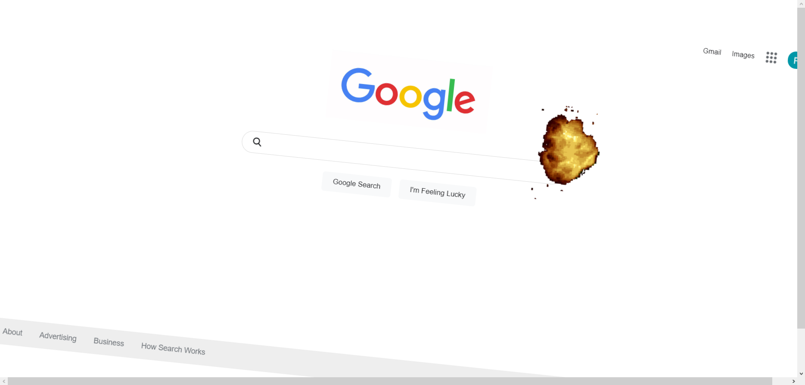

# React NASA Dart Clone

Live website: https://fatihbulbul1.github.io/react-nasa-dart-clone/
# Overview
Made by:
- React
- HTML keyframes

### Fonts and Colors
 ```css
    font-family: Arial, Helvetica, sans-serif;
    color: #202124;
 ```
## Description 
- The animation inspired by NASA's trending project "dart" and it's Google search page. [Check the original page.](https://www.google.com/search?client=opera-gx&q=nasa+dart&sourceid=opera&ie=UTF-8&oe=UTF-8)
- This is Google landing page clone with satallite crash animation with keyframes.

### Author
- LinkedIn - [Ömer Fatih Bülbül](https://www.linkedin.com/in/ömer-fatih-bülbül-74a890236/)
- Twitter - [fatihbulbul91](https://twitter.com/fatihbulbul91)
- Frontend Mentor - [fatihbulbul1](https://www.frontendmentor.io/profile/fatihbulbul1)